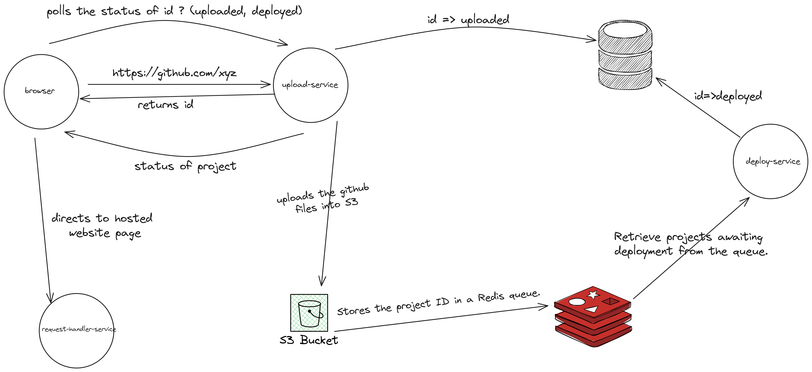

# vercel-clone
ExcaliDraw Diagram: https://app.eraser.io/workspace/0f8XnDF61iGcatypPqIR?origin=share

### Setup Guide

This Project contains following services and folders:

- `vercel-upload-service`: An HTTP API server for handling REST API requests. It clones and pushes files to S3 into an "outputs" directory.
- `vercel-deploy-service`: A service responsible for retrieving files from S3, building them, and pushing the resulting files back to S3 into a "dist" directory.
- `vercel-request-handler`: A service that manages the redirection of the deployed URL on the internet.
- `frontend`: code for frontend

### Local Setup

1. Run `npm install` in all the 3 services i.e. `vercel-upload-service`, `vercel-deploy-service` and `vercel-request-handler`
2. Make Local redis Server Up 
3. Run the following commands `npm tsc -b` and `node dist/index.js` to compile and run the servers in all the 3 services.
4. Run the following command npm run dev to start the frontend.

At this point following services would be up and running:

| S.No | Service                  | PORT    |
| ---- | ------------------------ | ------- |
| 1    | `vercel-upload-service`  | `:3000` |
| 2    | `vercel-deploy-service`  |   -     |
| 3    | `vercel-request-handler` | `:3001` |
| 4    | `frontend`               | `:5173` |

### Architecture

